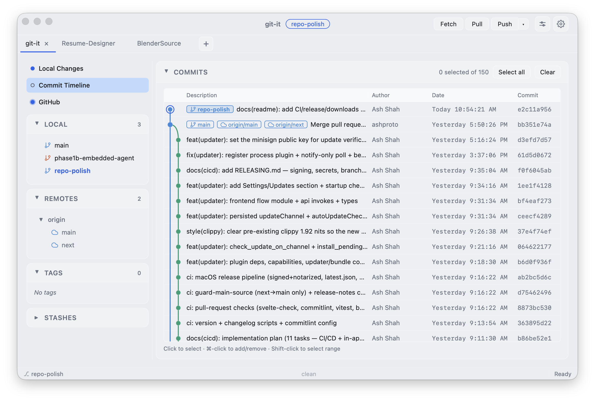
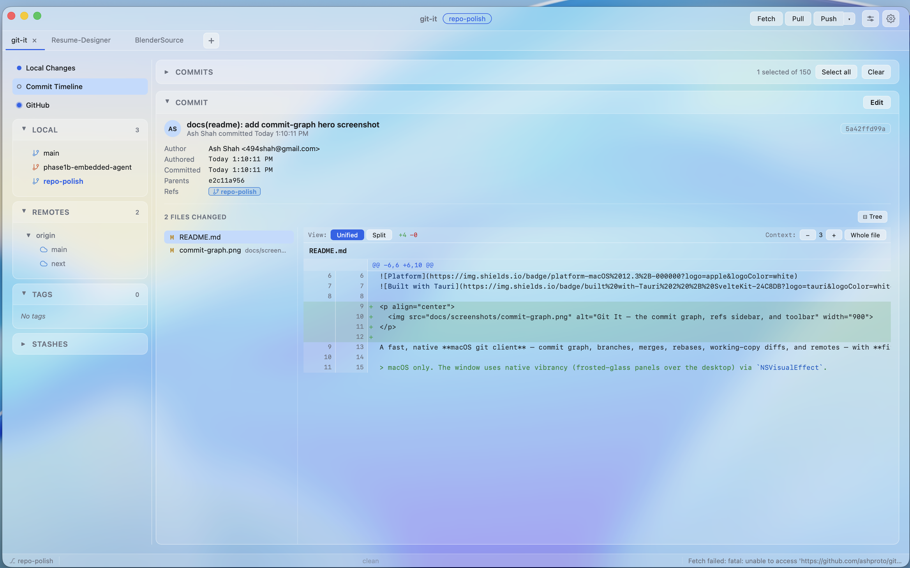
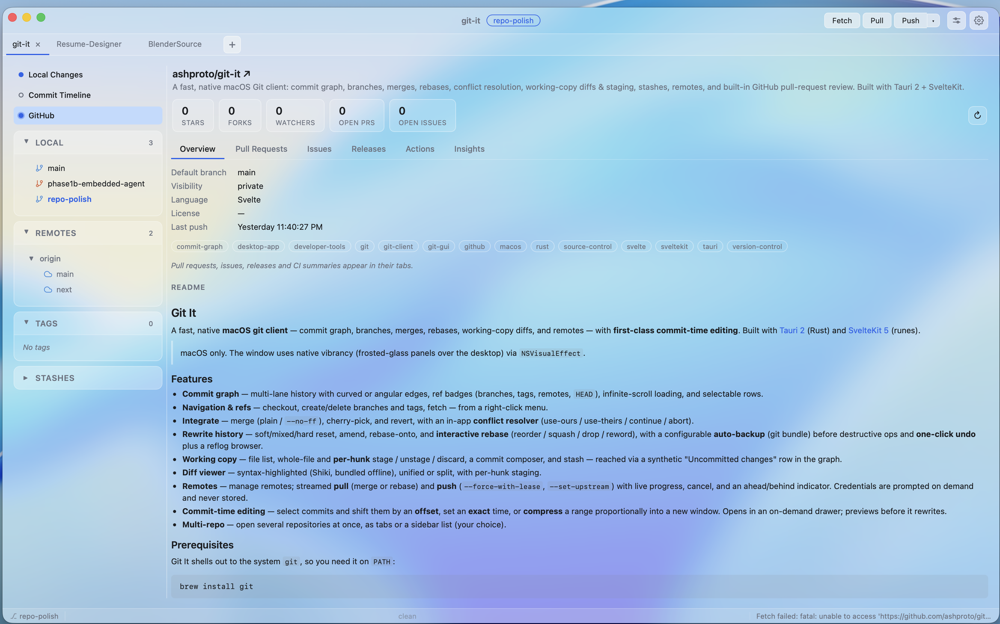
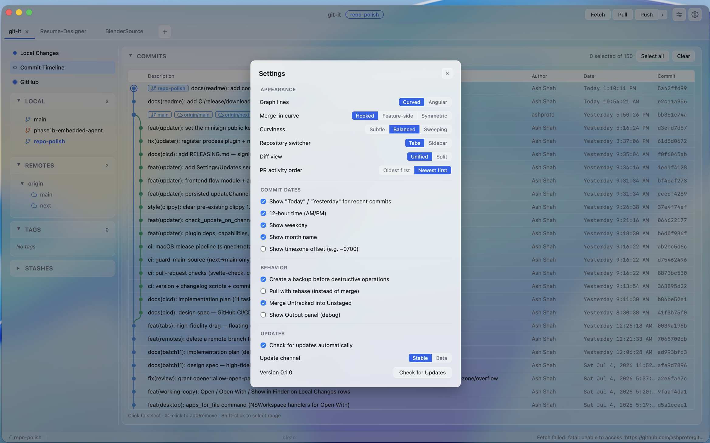

# Git It

[](https://github.com/ashproto/git-it/actions/workflows/ci.yml)
[](https://github.com/ashproto/git-it/releases/latest)
[](https://github.com/ashproto/git-it/releases)


<p align="center">
  
</p>

A fast, native **macOS git client** — commit graph, branches, merges, rebases, working-copy diffs, and remotes — with **first-class commit-time editing**. Built with [Tauri 2](https://tauri.app) (Rust) and [SvelteKit 5](https://svelte.dev) (runes).

> macOS only. In its default **Classic** theme the window uses native vibrancy (frosted-glass panels over the desktop) via `NSVisualEffect`; the **NERV** theme swaps in a solid high-contrast console look (Settings → Appearance).

## Download

**[⬇ Download the latest release](https://github.com/ashproto/git-it/releases/latest)** — open the `.dmg`, drag **Git It.app** into `/Applications`, and launch. It keeps itself up to date after that (in-app auto-updates, with an optional beta channel in Settings → Updates).

> Requires **macOS 12.3+**. The release ships separate **Apple Silicon** and **Intel** builds — download the `.dmg` that matches your Mac (each runs fully native). In-app updates then track the right build automatically.

## Features

- **Commit graph** — multi-lane history with curved or angular edges, ref badges (branches, tags, remotes, `HEAD`), infinite-scroll loading, and selectable rows.
- **Navigation & refs** — checkout, create/delete branches and tags, fetch — from a right-click menu.
- **Integrate** — merge (plain / `--no-ff`), cherry-pick, and revert, with an in-app **conflict resolver** (use-ours / use-theirs / continue / abort).
- **Rewrite history** — soft/mixed/hard reset, amend, rebase-onto, and **interactive rebase** (reorder / squash / drop / reword), with a configurable **auto-backup** (git bundle) before destructive ops and **one-click undo** plus a reflog browser.
- **Working copy** — file list, whole-file and **per-hunk** stage / unstage / discard, a commit composer, and stash — reached via a synthetic "Uncommitted changes" row in the graph.
- **Diff viewer** — syntax-highlighted (Shiki, bundled offline), unified or split, with per-hunk staging.
- **Remotes** — manage remotes; streamed **pull** (merge or rebase) and **push** (`--force-with-lease`, `--set-upstream`) with live progress, cancel, and an ahead/behind indicator. Credentials are prompted on demand and never stored.
- **Commit-time editing** — select commits and shift them by an **offset**, set an **exact** time, or **compress** a range proportionally into a new window. Opens in an on-demand drawer; previews before it rewrites.
- **Multi-repo** — open several repositories at once, as tabs or a sidebar list (your choice).
- **Themes** — Settings → Appearance switches the whole UI between **Classic** (native macOS vibrancy) and **NERV**, a high-contrast HUD console theme with six accent schemes and optional ambient motion.

## Screenshots

<p align="center">
  <br>
  <em>Inspect any commit — changed files and a syntax-highlighted diff, unified or split, with per-hunk staging.</em>
</p>

<p align="center">
  <br>
  <em>Built-in GitHub — pull requests, issues, releases, and CI runs, right next to your local history.</em>
</p>

<p align="center">
  <br>
  <em>Settings — graph styling, date formatting, and in-app auto-updates with an optional beta channel.</em>
</p>

## Prerequisites

Git It needs `git` and `python3`, both of which ship with the **Xcode Command Line Tools**:

```sh
xcode-select --install
```

[`git-filter-repo`](https://github.com/newren/git-filter-repo) — used by the **commit-time editing** feature — is bundled inside the app and run with the host's `python3`, so there is nothing extra to install.

If `git` or `python3` is missing, the app shows a startup banner with an **Install Command Line Tools** button (it runs `xcode-select --install` for you). No Python interpreter is bundled — only the interpreter is host-provided; the `git-filter-repo` script itself ships with the app.

## Install (end users)

1. Open the `.dmg` (built with `npm run tauri build`).
2. Drag **Git It.app** into `/Applications`.
3. First launch: right-click the app → **Open** (Gatekeeper warns for ad-hoc-signed builds).

## Build from source

```sh
npm install
npm run tauri dev      # run the app in development
npm run tauri build    # produce Git It.app + a .dmg under src-tauri/target/release/bundle/
```

Checks and tests:

```sh
npm run check                 # Svelte + TypeScript
npm test                      # Vitest (lane engine + diff parser)
cd src-tauri && cargo check   # Rust
cd src-tauri && cargo test    # Rust tests
```

## Architecture

| Layer | What it does | Files |
|---|---|---|
| Rust commands | typed Tauri command surface | `src-tauri/src/commands.rs`, `lib.rs` |
| Git operations | subprocess wrappers per area | `git_ops.rs` (core), `ops.rs` (nav/refs), `ops_merge.rs` (merge/cherry-pick/revert), `ops_rewrite.rs` (reset/amend/rebase), `ops_worktree.rs` (status/stage/diff/stash), `ops_remote.rs` (pull/push/credentials), `safety.rs` (backups/undo), `rewrite.rs` (timestamps) |
| Graph data | parents, refs, lanes, status | `src-tauri/src/graph.rs`, `types.rs` |
| Lane engine | pure-TS graph layout (fully unit-tested) | `src/lib/graph/` |
| TypeScript API | typed `invoke()` wrappers | `src/lib/api.ts`, `src/lib/gitActions.ts` |
| State | central reactive store (Svelte 5 runes) | `src/lib/store.svelte.ts` |
| UI | one component per panel/dialog/drawer | `src/lib/components/*.svelte` |
| Shell | app layout + chrome | `src/routes/+page.svelte` |

**Security note:** every `git` invocation that takes a user-supplied operand separates options from operands (`--` / `--end-of-options`) so a crafted branch/ref/path can't smuggle in a flag; force-push is always `--force-with-lease`, never bare `--force`; commit messages go through a temp file, never `-m`; and credentials are passed via a generated `GIT_ASKPASS` reading `0600` scratch files, never on `argv` or in app state.

The commit-time **critical path** — building the `git-filter-repo` callback that maps each selected commit to its new epoch/offset — lives in [`src-tauri/src/rewrite.rs`](src-tauri/src/rewrite.rs).

## Distribution

```sh
npm run tauri build -- --bundles dmg
# → src-tauri/target/release/bundle/dmg/Git It_0.1.0_aarch64.dmg
```

Ad-hoc signing (fine for trusted users; Gatekeeper warns on first launch):

```sh
codesign --force --deep --sign - "src-tauri/target/release/bundle/macos/Git It.app"
```

For zero-friction installs, sign with an Apple Developer ID and notarize — `tauri.conf.json` supports `bundle.macOS.signingIdentity` and the notarization environment variables.

## Known limitations

- macOS only (the vibrancy/glass and titlebar handling are macOS-specific).
- `git` and `python3` must be present (both come with the Xcode Command Line Tools); commit-time editing runs the bundled `git-filter-repo` via the host `python3`. The startup banner surfaces a missing prerequisite and offers to install the tools.
- Ad-hoc-signed builds trigger a Gatekeeper warning on first launch.
- Very large histories load incrementally but aren't yet DOM-virtualized.

## License

**Free · source-available · noncommercial** — Git It is licensed under [Creative Commons Attribution-NonCommercial-ShareAlike 4.0](https://creativecommons.org/licenses/by-nc-sa/4.0/) (CC BY-NC-SA 4.0). See [`LICENSE`](LICENSE) for the full terms.

- **Use it for anything, including at work.** Managing your repositories with Git It — personal or commercial — is fine. The noncommercial term is about the app itself, not the work you produce with it.
- **Don't commercialize the app.** No reselling, repackaging-and-selling, or offering it as a paid hosted service.
- **ShareAlike.** Distribute modified versions under these same terms.

Want a commercial arrangement this license doesn't cover? Open an issue. This is a source-available, noncommercial license — **not** an OSI-approved open-source license.

Git It bundles [`git-filter-repo`](https://github.com/newren/git-filter-repo) under the MIT License; its notice ships at [`src-tauri/resources/git-filter-repo/COPYING.mit`](src-tauri/resources/git-filter-repo/COPYING.mit).
